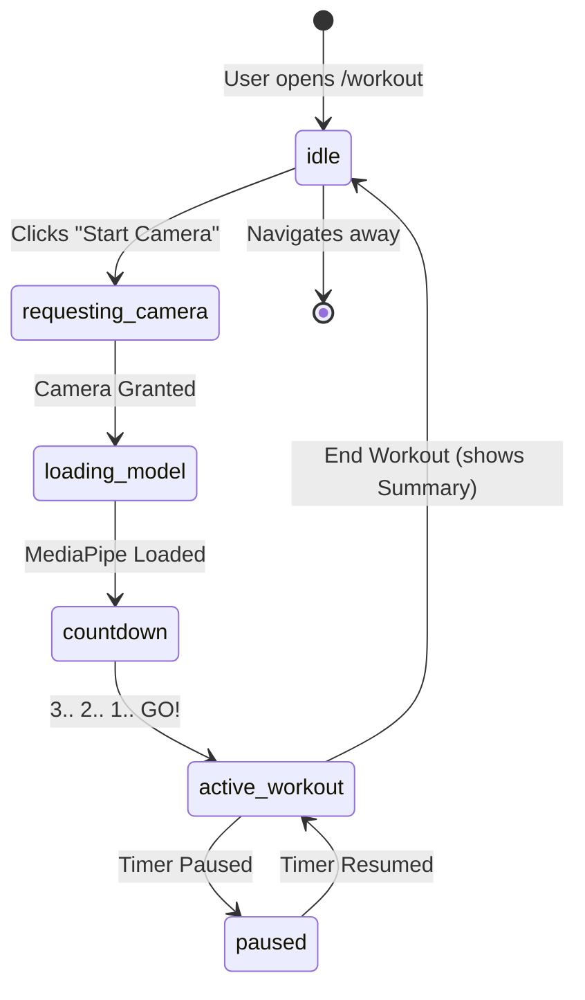
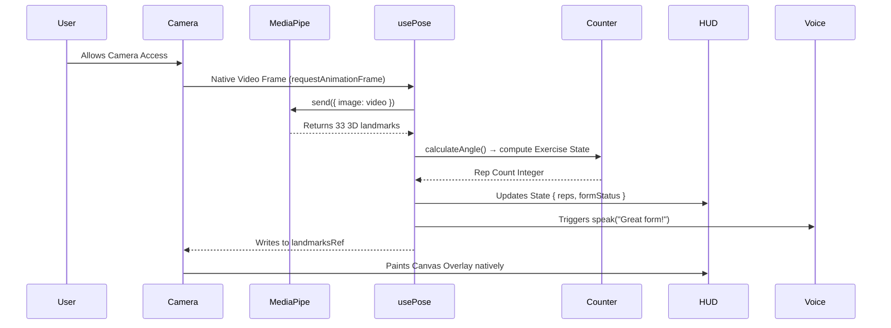

# 🏗️ Architecture — Smart AI Vision Trainer

This document describes the data flow, component relationships, and application structure for the Smart AI Vision Trainer SaaS.

---

## 🧭 System Architecture Diagram

```mermaid
graph TD
    subgraph Browser Ecosystem
        A[index.html] --> B[main.tsx]
        B --> C[App Shell / Router]

        subgraph Core App Shell
            C --> ThemeProvider
            C --> Layout
            Layout --> Navbar
            Layout --> Footer
            Layout --> RouterOutlet[React Router Outlet]
        end

        subgraph Pages
            RouterOutlet --> Home[Landing Page / Marketing]
            RouterOutlet --> WorkoutPage[Active Workout Experience]
            RouterOutlet --> History[User History]
            RouterOutlet --> Settings[Profile & Settings]
        end

        subgraph Workout Feature Module
            WorkoutPage --> Setup[Exercise Setup]
            WorkoutPage --> Countdown[Countdown Overlay]
            WorkoutPage --> CameraFeed[Camera System]
            WorkoutPage --> Timer[Workout Timer HUD]
            WorkoutPage --> Summary[Workout Summary]
            
            CameraFeed --> PoseOverlay[Pose Skeleton UI]
            CameraFeed --> HUD[Heads-Up Display]
        end

        subgraph Hooks & Logic
            CameraFeed --> usePose["usePose()"]
        end

        subgraph Engine Layer 🧠
            usePose --> angleCalculator[Biomechanics Math]
            usePose --> pushup[Push-Up SM]
            usePose --> squat[Squat SM]
            usePose --> curl[Curl SM]
            usePose --> jj[Jumping Jack SM]
            usePose --> formValidator[Form Validation]
            usePose --> voiceCoach[Voice Engine]
            usePose --> workoutTracker[Session Tracker]
        end

        subgraph External Providers
            MediaPipe["MediaPipe Pose (CDN JS/WASM)"]
            SpeechSynthesis["Browser Speech API"]
        end

        usePose --> MediaPipe
        voiceCoach --> SpeechSynthesis
    end
```

---

## 🏃 Workout State Machine (Workout.tsx)

The workout flow is managed by a strict state machine to ensure flawless UX and avoid dead states.



---

## 📊 Real-Time Pose Data Flow



---

## 📦 Component Responsibilities

| Component / File | Role | Key Interactions |
|------------------|------|------------------|
| `Router.tsx` / `Layout.tsx` | Global app shell, routing configuration, persistent nav elements. | Coordinates page transitions and theming. |
| `Home.tsx` (Landing) | Marketing and pre-app experience. Showcases features, interactive demos. | Links to `/workout`. |
| `Workout.tsx` | Manages the primary active workout state machine. | Mounts overlays, camera, and timer based on state. |
| `CameraFeed.tsx` | Handles `getUserMedia`, camera permissions, and encapsulates `usePose`. | Yields video stream to MediaPipe, displays canvas. |
| `CountdownOverlay` | Blocks tracking until the 3s warmup phase finishes. | Delays `workoutTracker.start Workout()`. |
| `WorkoutTimer` | Decoupled `requestAnimationFrame` precise stopwatch. | Renders MM:SS HUD independent of React component cycle. |

## ⚙️ Engine Level Modules

| Module | Purpose | Interface |
|--------|---------|-----------|
| `angleCalculator` | 3D joint angle math vector computation | `calculateAngle(A, B, C) → degrees` |
| `[Exercise]Counter` | Dedicated state machines for tracking rep execution | `countPushup(angle) → Number` |
| `formValidator` | Computes correct skeletal alignment | `validateForm(landmarks) → FormStatus` |
| `voiceCoach` | Queue-based Text-to-speech with cooldowns | `speak(text) → void` |

---

## 🏗️ Architectural Guiding Principles

1. **Strictly Client-Side Computer Vision:** All machine learning executes rapidly on the user's local device hardware (via WebAssembly), guaranteeing extreme privacy and minimizing server latency costs.
2. **Decoupled Animation & Rendering:** Critical high-volume render paths (like the MediaPipe coordinate `Canvas` drawing and the workout `Stopwatch`) bypass React's standard state machinery and run on native `requestAnimationFrame` loops.
3. **Tokenized Design System:** All UI aesthetics flow through `theme.css`. Components do not hardcode colors, spacing, or timing, allowing pure consistency and simple robust Dark Mode switching.
4. **Predictable State Machines:** UI states like the workout process follow deterministic state graphs (`idle` -> `camera_request` -> `loading` -> `countdown` -> `active`), avoiding ambiguous component states.
