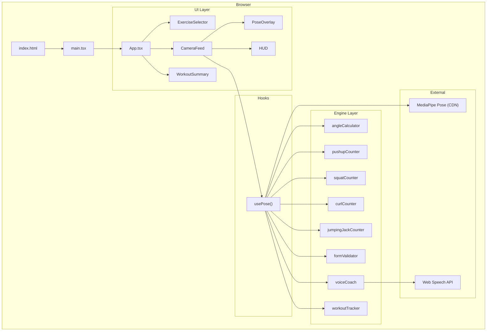
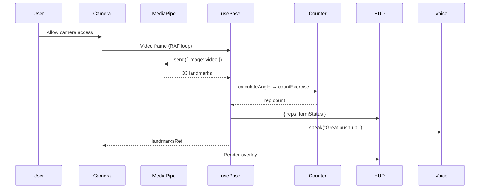

# 🏗️ Architecture — Smart AI Vision Trainer

This document describes the data flow and component relationships in the application.

---

## System Architecture Diagram

---

## Data Flow

---

## Component Responsibilities

| Component | Role | Inputs | Outputs |
|-----------|------|--------|---------|
| `App.tsx` | App shell, workout lifecycle | — | Exercise type, session state |
| `CameraFeed` | Camera access, composition root | exercise, callbacks | Video stream, pose data |
| `PoseOverlay` | Skeleton visualization | videoRef, landmarksRef | Canvas drawing |
| `HUD` | Stats display | exercise, reps, formStatus | UI overlay |
| `ExerciseSelector` | Exercise picker | value, onChange | Selected exercise |
| `WorkoutSummary` | Post-workout display | WorkoutSession | Stats card |

## Engine Module Responsibilities

| Module | Role | Interface |
|--------|------|-----------|
| `angleCalculator` | 3D joint angle math | `calculateAngle(A, B, C) → degrees` |
| `pushupCounter` | Push-up state machine | `countPushup(elbowAngle) → reps` |
| `squatCounter` | Squat state machine | `countSquat(kneeAngle) → reps` |
| `curlCounter` | Curl state machine | `countCurl(elbowAngle) → reps` |
| `jumpingJackCounter` | Jumping jack state machine | `countJumpingJack(isOpen) → reps` |
| `formValidator` | Push-up form checking | `validatePushupForm(landmarks) → FormStatus` |
| `voiceCoach` | Text-to-speech | `speak(text) → void` |
| `workoutTracker` | Session management | `startWorkout / recordRep / endWorkout` |

---

## Key Design Decisions

1. **Client-side only** — All ML inference runs in the browser via MediaPipe WASM. No server needed.
2. **Ref-based landmarks** — Pose data is stored in a React ref (not state) to avoid 30fps re-renders.
3. **Decoupled RAF loops** — PoseOverlay runs its own animation loop, independent from React rendering.
4. **Module-level state** — Exercise counters use module-scoped variables for simplicity (not class instances).
5. **CDN-loaded model** — MediaPipe model files are loaded from jsDelivr CDN at runtime.
